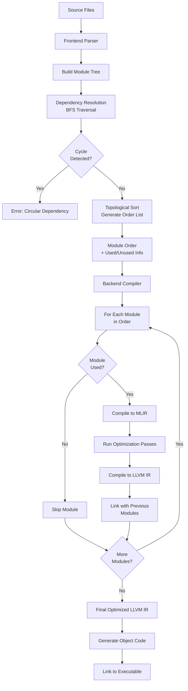

```mermaid
graph TD
    A["Source Files"] --> B["Frontend Parser"]
    B --> C["Build Module Tree"]
    C --> D["Dependency Resolution<br/>BFS Traversal"]
    D --> E{"Cycle<br/>Detected?"}
    E -->|Yes| F["Error: Circular Dependency"]
    E -->|No| G["Topological Sort<br/>Generate Order List"]
    G --> H["Module Order<br/>+ Used/Unused Info"]
    H --> I["Backend Compiler"]
    I --> J["For Each Module<br/>in Order"]
    J --> K{"Module<br/>Used?"}
    K -->|No| L["Skip Module"]
    K -->|Yes| M["Compile to MLIR"]
    M --> N["Run Optimization Passes"]
    N --> O["Compile to LLVM IR"]
    O --> P["Link with Previous<br/>Modules"]
    L --> Q{"More<br/>Modules?"}
    P --> Q
    Q -->|Yes| J
    Q -->|No| R["Final Optimized LLVM IR"]
    R --> S["Generate Object Code"]
    S --> T["Link to Executable"]
```